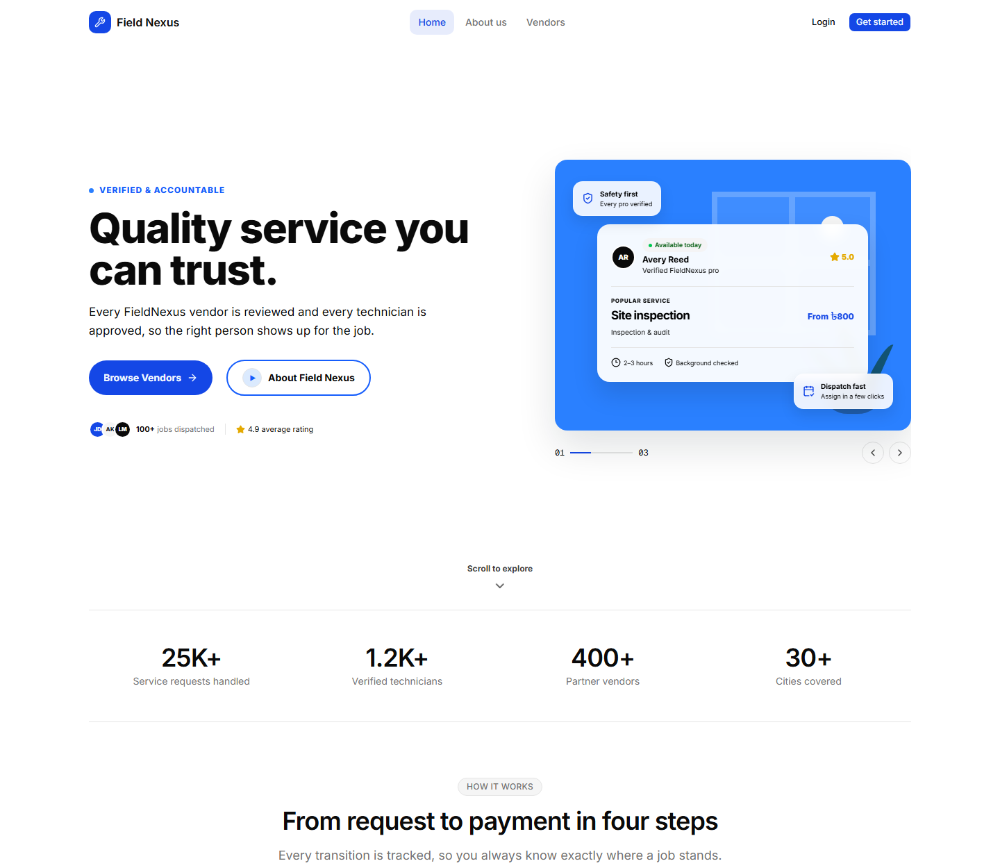

# Field Nexus — Frontend



**Field Nexus** is a **B2B multi-vendor field service management platform**. It sits between a large enterprise that needs technicians dispatched to customer homes and offices, and the network of **subcontractor vendor companies** that actually employ those technicians.

The frontend is the complete web client for the platform: a public marketing site and vendor directory, a full authentication system, and four role-based dashboards that manage the entire lifecycle of a field service job — from a customer's service request, through admin approval and technician assignment, to completion, feedback, and **bKash** payment/refund.

> Instead of a company manually juggling hundreds of technicians with phone calls and paper files, Field Nexus provides a single hub where jobs are created, assigned, tracked, completed, and paid — end to end.

**Live frontend:** _not deployed yet — static build ready (see [Deployment](#deployment))_
**Live backend API:** <https://fieldnexus-backend.vercel.app>

---

## Table of Contents

- [Tech Stack](#tech-stack)
- [Key Features](#key-features)
- [Dependencies](#dependencies)
- [Getting Started](#getting-started)
- [Environment Variables](#environment-variables)
- [Available Scripts](#available-scripts)
- [Project Structure](#project-structure)
- [Roles & Access Control](#roles--access-control)
- [Work Order Lifecycle](#work-order-lifecycle)
- [API Integration](#api-integration)
- [Deployment](#deployment)
- [Relevant Links](#relevant-links)

---

## Tech Stack

| Category | Technology |
|----------|------------|
| Framework | **Next.js 16** (App Router, static export) |
| UI Library | **React 19.2** + **React Compiler** enabled |
| Language | **TypeScript 5** (strict mode) |
| Styling | **Tailwind CSS v4** (CSS-first config) + `tw-animate-css` |
| Component System | **shadcn/ui** (`base-nova` style) on **Base UI** primitives |
| Server State | **TanStack Query v5** (73 query/mutation hooks) |
| Forms & Validation | **TanStack Form v1** + **Zod v4** |
| HTTP Client | **ofetch** (`credentials: "include"`, httpOnly cookie session) |
| Authentication | Email/password + **Google OAuth 2.0** (`@react-oauth/google`), OTP flows |
| Charts | **Recharts v3** (wrapped via shadcn `chart.tsx`) |
| Animation | **GSAP 3** |
| Carousel | **Embla Carousel** |
| Icons | **Lucide React** |
| Class Utilities | `cn` + **class-variance-authority** |
| Linting & Formatting | **Biome 2.4** (replaces ESLint + Prettier) |
| Package Manager | **Bun 1.4.2** |
| Deployment | Static export (`output: "export"`) → any static host |

---

## Key Features

### Public Site
- **Marketing landing page** — hero, stats, how-it-works, features, and CTA sections
- **About Us** — company story, values, roles, and an animated walkthrough
- **Vendor directory** — search, filter, and paginate approved vendors publicly
- **Vendor profile pages** — detailed public view per vendor
- **Legal pages** — Terms of Service, Privacy Policy, and Security overview with an in-page table of contents

### Authentication
- Customer registration with **6-digit email OTP verification** and resend-OTP support
- Login with **email/password** or **Google OAuth**
- **Forgot password** → OTP → **reset password** flow, with resend-OTP support
- Technician job **application** form (public, with resume upload)
- Session handled via **httpOnly cookies**; no tokens in `localStorage`
- Current-user session resolved through a `["USER"]` TanStack Query with `retry: false`

### Customer Dashboard
- Overview with active work orders, status breakdown, and notifications
- **Book a service** — create work orders with category, priority, and scheduling
- **Payment history** — payments and refunds table with status badges
- Profile editing with Cloudinary-backed picture upload

### Technician Dashboard
- **Assigned jobs** list with accept / reject assignment actions
- Advance jobs through the status machine (`ACCEPTED → EN_ROUTE → IN_PROGRESS → COMPLETED`)
- **Service reports** — description, parts used, and hours worked
- Read-only **payments** view for assigned jobs
- In-app **notifications**

### Admin Dashboard
- **Overview KPIs** — totals and status distribution across customers, technicians, vendors, and work orders
- **User management** — tabbed tables, search, pagination, bulk actions, block / unblock / delete / **restore**
- **Vendor management** — create, update, status badges, soft delete & restore, and a **performance analytics** modal
- **Vendor teams** — add / remove / restore technician members
- **Technician approval** — review, approve, or reject technician applications
- **Work order management** — create, update, status transitions, technician assignment
- **Audit logs** — filterable trail by action and entity

### Super Admin Dashboard
- Full **admin account** management — create, block, unblock, delete, restore
- **Reset admin passwords** and **change admin emails** via popovers
- Combined with the Admin sidebar for platform-wide control

### Cross-Cutting
- **Role-aware navigation** — each role sees only its own sidebar routes
- **Optimistic locking** — work order status updates send the current `version` to prevent lost updates
- **Reusable data tables** — search with debounce, sorting, pagination, bulk selection, loading skeletons
- **Route-level error boundaries** on every admin surface with friendly recovery messaging
- **Suspense + skeleton loading states** across all data-heavy screens

---

## Dependencies

### `dependencies`

| Package | Version | Purpose |
|---------|---------|---------|
| `next` | `16.3.4` | App Router framework, static export |
| `react` / `react-dom` | `19.2.8` | UI runtime |
| `@base-ui/react` | `^1.8.0` | Unstyled accessible primitives (shadcn base) |
| `shadcn` | `^4.21.0` | shadcn/ui CLI + component registry |
| `class-variance-authority` | `^0.7.1` | Variant-based component styling |
| `cn` | `^0.2.6` | Conditional class name merging |
| `tw-animate-css` | `^1.4.0` | Tailwind animation utilities |
| `@tanstack/react-query` | `^5.102.8` | Server state, caching, mutations |
| `@tanstack/react-form` | `^1.33.5` | Form state management |
| `zod` | `^4.6.1` | Schema validation for all forms |
| `ofetch` | `^1.5.1` | HTTP client for the backend API |
| `@react-oauth/google` | `^0.13.5` | Google sign-in |
| `recharts` | `^3.10.1` | Chart primitives |
| `gsap` | `^3.15.0` | Animations |
| `embla-carousel-react` | `^8.6.0` | Carousel primitives |
| `embla-carousel-autoplay` | `^8.6.0` | Carousel autoplay |
| `input-otp` | `^1.5.0` | OTP / PIN input component |
| `lucide-react` | `^1.44.0` | Icon set |

### `devDependencies`

| Package | Version | Purpose |
|---------|---------|---------|
| `typescript` | `^5` | Type checking (`strict: true`) |
| `tailwindcss` + `@tailwindcss/postcss` | `^4` | Styling engine and PostCSS plugin |
| `@biomejs/biome` | `2.4.2` | Linter + formatter |
| `babel-plugin-react-compiler` | `1.0.0` | React Compiler transform |
| `@types/node`, `@types/react`, `@types/react-dom` | `^20`, `^19` | Type declarations |

---

## Getting Started

### Prerequisites

- **Node.js 20.9+** — <https://nodejs.org>
- **Bun 1.4.2** (recommended, this project's package manager) — <https://bun.sh>
- **The Field Nexus backend running locally** on port `5000` — see the [backend repo](https://github.com/mdashraful24/fieldnexus-backend-l2b7a6)

### 1. Clone the repository

```bash
git clone https://github.com/mdashraful24/fieldnexus-frontend-l2b7a7.git
cd fieldnexus-frontend-l2b7a7
```

### 2. Install dependencies

```bash
bun install
```

<details>
<summary>Using npm / pnpm / yarn instead?</summary>

```bash
npm install        # or: pnpm install  /  yarn install
```

Note: `bun.lock` is the committed lockfile, so `bun install` is the most reproducible path.
</details>

### 3. Configure environment variables

Create a `.env.local` file in the project root:

```bash
NEXT_PUBLIC_API_URL=http://localhost:5000/api/v1
NEXT_PUBLIC_GOOGLE_CLIENT_ID=your-google-oauth-client-id.apps.googleusercontent.com
```

Google sign-in degrades gracefully — if `NEXT_PUBLIC_GOOGLE_CLIENT_ID` is unset, the Google button is simply not rendered. See [Environment Variables](#environment-variables) for the full reference.

### 4. Start the backend

The frontend is useless without the API. Start the Field Nexus backend so it is reachable at `http://localhost:5000/api/v1`. The backend seeds a **Super Admin**, an **Admin**, a **Tester Technician**, and a **Tester Vendor** on first boot, so you can log in immediately with those seeded credentials.

### 5. Run the development server

```bash
bun run dev
```

Open <http://localhost:3000> in your browser.

### 6. Build for production

```bash
bun run build     # static export written to ./out
```

---

## Environment Variables

| Variable | Required | Description |
|----------|----------|-------------|
| `NEXT_PUBLIC_API_URL` | **Yes** | Base URL of the backend API, including the version segment (e.g. `http://localhost:5000/api/v1`). Read in `src/lib/apiClient.ts:3`. |
| `NEXT_PUBLIC_GOOGLE_CLIENT_ID` | No | Google OAuth 2.0 web client ID. Enables the "Continue with Google" button. |
| `SUPER_ADMIN_NAME` / `_EMAIL` / `_PASSWORD` | No | Consumed by the **backend** seeder to create the initial Super Admin. |
| `FIELD_NEXUS_ADMIN_NAME` / `_EMAIL` / `_PASSWORD` | No | Consumed by the **backend** seeder to create the initial Admin. |
| `TESTER_TECHNICIAN_NAME` / `_EMAIL` / `_PASSWORD` | No | Consumed by the **backend** seeder to create a test Technician. |

> **Note:** Only `NEXT_PUBLIC_API_URL` and `NEXT_PUBLIC_GOOGLE_CLIENT_ID` are read by this frontend. The credential variables exist in the local `.env.local` because the backend reads the same file to seed accounts. All variables are prefixed-safe: `.env*` is gitignored, so keep secrets out of version control.

---

## Available Scripts

| Script | Command | Description |
|--------|---------|-------------|
| `bun run dev` | `next dev` | Start the dev server on port 3000 |
| `bun run build` | `next build` | Production build + **static export** to `./out` |
| `bun run start` | `next start` | ⚠️ Unavailable — this project uses `output: "export"`. See [Deployment](#deployment). |
| `bun run lint` | `biome check` | Lint + format check across the project |
| `bun run format` | `biome format --write` | Auto-format files in place |

> **Current state:** `bun run lint` reports a number of pre-existing diagnostics (mostly formatter and import-order differences in the vendored `components/ui` files). Run `bun run format` to resolve the bulk of them automatically.

**Type checking** is done via the compiler, no separate script:

```bash
bunx tsc --noEmit
```

---

## Project Structure

```
src/
├── api/          # Raw ofetch calls, one module per domain (auth, user, vendor, work-order, ...)
├── app/          # Next.js App Router
│   ├── (public)/         # Pathless: marketing pages + authentication screens
│   │   ├── (marketing)/  # /, /about-us, /vendors, /privacy, /security, /terms
│   │   └── (authentication)/ # /login, /register, /apply, forgot-password
│   └── (dashboard)/      # Pathless: AuthGuard wrapper
│       ├── admin/        # Admin + Super Admin screens
│       ├── customer/     # Customer screens
│       ├── technician/   # Technician screens
│       └── profile/      # Shared profile (all roles)
├── components/
│   ├── ui/               # 24 shadcn/ui components (Base UI based)
│   ├── auth/             # AuthGuard, RoleGuard, AccessDenied
│   ├── dashboard/        # DashboardShell, DashboardSidebar
│   ├── form/             # Shared auth & application forms
│   ├── layout/           # Public Header, Footer, Container
│   └── modules/          # Feature UI grouped by domain
├── hooks/        # TanStack Query hooks (useX / useSuspenseGetX)
├── lib/          # apiClient (ofetch), apiError helpers, cn re-export
├── providers/    # Query, Google OAuth, tooltip providers
├── routes/       # Per-role sidebar route config
├── types/        # TypeScript domain + API types
├── utils/        # Formatting helpers (file size, currency)
└── validation/   # Zod schemas per form domain
```

**Data flow convention:** `api/` (HTTP) → `hooks/` (query + mutation) → `components/modules/<feature>/` (UI) → `types/` + `validation/`.
Pages stay thin — they render a `modules/*` component inside `<Suspense>` with a matching `*-loading.tsx` skeleton.

**Path alias:** `@/*` → `./src/*`

---

## Roles & Access Control

Four roles, each with a dedicated dashboard and sidebar (`src/routes/*.routes.ts`):

| Role | Capabilities |
|------|--------------|
| **Super Admin** | Manages Admin accounts, restores soft-deleted records, highest platform privileges |
| **Admin** | Creates work orders, approves vendors and technician applications, assigns technicians, cancels orders, processes refunds, reviews audit logs |
| **Technician** | Accepts/rejects assignments, moves jobs through `EN_ROUTE → IN_PROGRESS → COMPLETED`, submits service reports |
| **Customer** | Creates work orders, cancels `PENDING`/`APPROVED` jobs, gives feedback, pays via bKash, requests refunds |

Guarding is done client-side by `AuthGuard` (session check) and `RoleGuard` (role allow-list) — see `src/components/auth/`. There is no `middleware.ts`, so **route protection is not server-enforced**; a static export has no server runtime to enforce it. The backend independently enforces authorization on every endpoint.

---

## Work Order Lifecycle

```
PENDING → APPROVED → ASSIGNED → ACCEPTED → EN_ROUTE → IN_PROGRESS → COMPLETED
   └──────────────────────────────┴───────────────┴──→ CANCELLED | REASSIGNED | FAILED
```

- Work order numbers are auto-generated as `WO-YYYYMMDD-NNNN`
- Priorities: `LOW` · `MEDIUM` · `HIGH` · `URGENT`, each with an auto-calculated SLA deadline
- Every status transition sends the record's current `version` (**optimistic locking**); the API returns `409` on a conflict
- Payments are only possible once a work order is `COMPLETED`; only `PAID` payments are refundable

---

## API Integration

- **Base URL:** from `NEXT_PUBLIC_API_URL` (default `http://localhost:5000/api/v1`)
- **Client:** a single shared `ofetch` instance in `src/lib/apiClient.ts` with `credentials: "include"`, so auth rides on **httpOnly cookies**
- **Envelope:** every response is `{ success, statusCode, message, data, meta? }`, typed via `ApiResponse<T>` in `src/types/api.type.ts`
- **Error handling:** `getApiErrorMessage(error, fallback)` in `src/lib/apiError.ts` unwraps `error.data.message` for user-facing toasts
- **No interceptors** — there is no automatic `401 → refresh-token` retry; refresh is cookie-driven on the backend

---

## Deployment

`next.config.ts` sets **`output: "export"`**, so `next build` produces a fully static site in `./out`. That means:

- ✅ Deploy to any static host — Vercel, Netlify, Cloudflare Pages, GitHub Pages, nginx
- ✅ `bun run start` (`next start`) is **not** compatible with a static export — serve the `out/` folder instead

To preview a production build locally:

```bash
bun run build
bunx serve out          # or: npx serve out
```

To deploy to Vercel, import the repository and set the environment variables (`NEXT_PUBLIC_API_URL`, `NEXT_PUBLIC_GOOGLE_CLIENT_ID`) in the project settings. Add your URL here as the live link.

---

## Relevant Links

| Resource | Link |
|----------|------|
| Frontend repository | <https://github.com/mdashraful24/fieldnexus-frontend-l2b7a7> |
| Backend repository | <https://github.com/mdashraful24/fieldnexus-backend-l2b7a6> |
| Live backend API | <https://fieldnexus-backend.vercel.app> |
| Backend Postman collection | [`FieldNexus_(Backend)(V1).postman_collection.json`](https://github.com/mdashraful24/fieldnexus-backend-l2b7a6) — bundled in the backend repo |
| Next.js documentation | <https://nextjs.org/docs> |
| shadcn/ui documentation | <https://ui.shadcn.com/docs> |
| Base UI documentation | <https://base-ui.com> |
| TanStack Query documentation | <https://tanstack.com/query/latest> |
| Biome documentation | <https://biomejs.dev> |
| Bun documentation | <https://bun.sh/docs> |

---

## License

ISC
